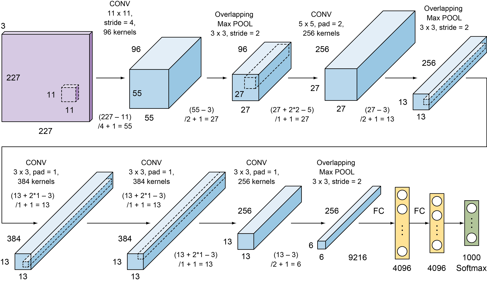
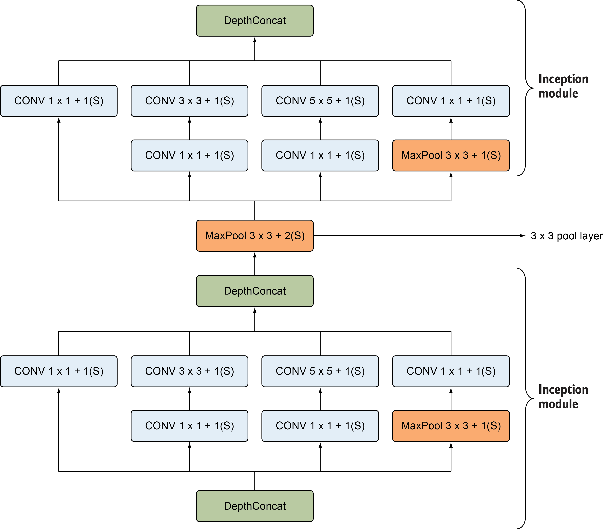
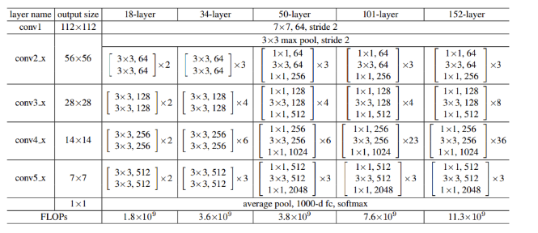
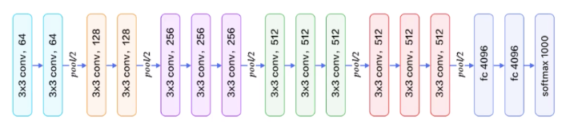

```{r setup, include=FALSE}
knitr::opts_chunk$set(echo = TRUE)
```

# Basic CNN Architecture

```{python, eval = FALSE}
from keras.models import Sequential
from keras.layers import Conv2D, AveragePooling2D, Flatten, Dense, Activation, MaxPool2D, BatchNormalization, Dropout, ZeroPadding2D

model = Sequential()

model.add(Conv2D(
  filters = 16, 
  kernel_size = 2, 
  padding = 'same', 
  activation='relu', 
  input_shape=(32, 32, 3))
  )

model.add(MaxPooling2D(
  pool_size=2)
  )

model.add(Conv2D(
  filters = 32, 
  kernel_size = 2, 
  padding = 'same', 
  activation = 'relu')
  )

model.add(MaxPooling2D(
  pool_size = 2)
  )

model.add(Conv2D(
  filters = 64, 
  kernel_size = 2, 
  padding = 'same', 
  activation = 'relu')
  )

model.add(MaxPooling2D(
  pool_size = 2)
  )

model.add(Dropout(0.3))

model.add(Flatten())

model.add(Dense(500, activation='relu'))

model.add(Dropout(0.4))

model.add(Dense(10, activation='softmax'))

model.summary()
```


And here is all of that again, but in pytorch:

```{python, eval = FALSE}
import torch
import torchvision
import torchvision.transforms as transforms
import torch.nn as nn
import torch.nn.functional as F


class Net(nn.Module):
    def __init__(self):
        super().__init__()
        self.conv1 = nn.Conv2d(3, 6, 5)
        self.pool = nn.MaxPool2d(2, 2)
        self.conv2 = nn.Conv2d(6, 16, 5)
        self.fc1 = nn.Linear(16 * 5 * 5, 120)
        self.fc2 = nn.Linear(120, 84)
        self.fc3 = nn.Linear(84, 10)

    def forward(self, x):
        x = self.pool(F.relu(self.conv1(x)))
        x = self.pool(F.relu(self.conv2(x)))
        x = torch.flatten(x, 1) # flatten all dimensions except batch
        x = F.relu(self.fc1(x))
        x = F.relu(self.fc2(x))
        x = self.fc3(x)
        return x


net = Net()
```

# AlexNet

Winner of the 2012 ImageNet challenge with a 15.3% error rate 



```{python, eval = FALSE}
model = Sequential(name="Alexnet")

model.add(Conv2D(
  filters = 96, kernel_size = (11,11), 
  strides = (4,4), padding='valid', 
  kernel_regularizer=l2(0.0005),
  input_shape = (227,227,3)))

model.add(Activation('relu'))

model.add(MaxPool2D(pool_size = (3,3), strides = (2,2), padding = 'valid'))

model.add(BatchNormalization())
    
# 2nd layer (conv + pool + batchnorm)
model.add(Conv2D(
  filters = 256, kernel_size = (5,5), 
  strides = (1,1), padding='same', 
  kernel_regularizer = l2(0.0005)))
model.add(Activation('relu'))
model.add(MaxPool2D(
  pool_size = (3,3), strides = (2,2), padding='valid'))
model.add(BatchNormalization())
            
# layer 3 (conv + batchnorm)
model.add(Conv2D(
  filters = 384, kernel_size = (3,3), 
  strides = (1,1), padding = 'same', 
  kernel_regularizer = l2(0.0005)))
model.add(Activation('relu'))
model.add(BatchNormalization())
        
# layer 4 (conv + batchnorm)  
model.add(Conv2D(
  filters = 384, kernel_size = (3,3), 
  strides = (1,1), padding = 'same', 
  kernel_regularizer = l2(0.0005)))
model.add(Activation('relu'))
model.add(BatchNormalization())
            
# layer 5 (conv + batchnorm)  
model.add(Conv2D(
  filters = 256, kernel_size = (3,3), 
  strides = (1,1), padding = 'same', kernel_regularizer = l2(0.0005)))
model.add(Activation('relu'))
model.add(BatchNormalization())
model.add(MaxPool2D(
  pool_size = (3,3), strides = (2,2), padding = 'valid'))

# Flatten the CNN output to feed it with fully connected layers
model.add(Flatten())

# layer 6 (Dense layer + dropout)  
model.add(Dense(units = 4096, activation = 'relu'))
model.add(Dropout(0.5))

# layer 7 (Dense layers) 
model.add(Dense(units = 4096, activation = 'relu'))
model.add(Dropout(0.5))
                           
# layer 8 (softmax output layer) 
model.add(Dense(units = 1000, activation = 'softmax'))

# print the model summary
model.summary()

```

# Inception

Rocking with a 6% error rate.



```{python, eval = FALSE}
def inception_module(x,
                     filters_1x1,
                     filters_3x3_reduce,
                     filters_3x3,
                     filters_5x5_reduce,
                     filters_5x5,
                     filters_pool_proj,
                     name=None):
    
    conv_1x1 = Conv2D(
      filters_1x1, (1, 1), padding = 'same', 
      activation = 'relu', kernel_initializer = kernel_init, 
      bias_initializer = bias_init)(x)
    
    conv_3x3 = Conv2D(
      filters_3x3_reduce, (1, 1), padding = 'same', 
      activation = 'relu', kernel_initializer = kernel_init, 
      bias_initializer=bias_init)(x)
      
    conv_3x3 = Conv2D(
      filters_3x3, (3, 3), padding = 'same', 
      activation = 'relu', kernel_initializer = kernel_init,
      bias_initializer = bias_init)(conv_3x3)

    conv_5x5 = Conv2D(
      filters_5x5_reduce, (1, 1), padding = 'same', 
      activation = 'relu', kernel_initializer = kernel_init, 
      bias_initializer=bias_init)(x)
      
    conv_5x5 = Conv2D(
      filters_5x5, (5, 5), padding = 'same', 
      activation = 'relu', kernel_initializer = kernel_init,
      bias_initializer=bias_init)(conv_5x5)

    pool_proj = MaxPool2D(
      (3, 3), strides = (1, 1), padding = 'same')(x)
      
    pool_proj = Conv2D(
      filters_pool_proj, (1, 1), padding = 'same', 
      activation = 'relu', kernel_initializer = kernel_init,
      bias_initializer = bias_init)(pool_proj)

    output = concatenate(
      [conv_1x1, conv_3x3, conv_5x5, pool_proj], 
      axis=3, name=name)
    
    return output
```

```{python, eval = FALSE}
kernel_init = keras.initializers.glorot_uniform()
bias_init = keras.initializers.Constant(value=0.2)

input_layer = Input(shape=(224, 224, 3))

x = Conv2D(
  64, (7, 7), padding='same', strides=(2, 2), 
  activation='relu', name='conv_1_7x7/2', 
  kernel_initializer=kernel_init, bias_initializer=bias_init)(input_layer)

x = MaxPool2D(
  (3, 3), padding='same', strides=(2, 2), 
  name='max_pool_1_3x3/2')(x)

x = Conv2D(
  192, (3, 3), padding='same', strides=(1, 1), 
  activation='relu', name='conv_2b_3x3/1')(x)

x = MaxPool2D(
  (3, 3), padding='same', strides=(2, 2), 
  name='max_pool_2_3x3/2')(x)

x = inception_module(x,
                     filters_1x1=64,
                     filters_3x3_reduce=96,
                     filters_3x3=128,
                     filters_5x5_reduce=16,
                     filters_5x5=32,
                     filters_pool_proj=32,
                     name='inception_3a')

x = inception_module(x,
                     filters_1x1=128,
                     filters_3x3_reduce=128,
                     filters_3x3=192,
                     filters_5x5_reduce=32,
                     filters_5x5=96,
                     filters_pool_proj=64,
                     name='inception_3b')

x = MaxPool2D(
  (3, 3), padding='same', strides=(2, 2), 
  name='max_pool_3_3x3/2')(x)

x = inception_module(x,
                     filters_1x1=192,
                     filters_3x3_reduce=96,
                     filters_3x3=208,
                     filters_5x5_reduce=16,
                     filters_5x5=48,
                     filters_pool_proj=64,
                     name='inception_4a')


classifier_1 = AveragePooling2D((5, 5), strides=3)(x)

classifier_1 = Conv2D(
  128, (1, 1), padding='same', 
  activation='relu')(classifier_1)

classifier_1 = Flatten()(classifier_1)

classifier_1 = Dense(1024, activation='relu')(classifier_1)

classifier_1 = Dropout(0.7)(classifier_1)

classifier_1 = Dense(10, activation='softmax', 
  name='auxilliary_output_1')(classifier_1)

x = inception_module(x,
                     filters_1x1=160,
                     filters_3x3_reduce=112,
                     filters_3x3=224,
                     filters_5x5_reduce=24,
                     filters_5x5=64,
                     filters_pool_proj=64,
                     name='inception_4b')

x = inception_module(x,
                     filters_1x1=128,
                     filters_3x3_reduce=128,
                     filters_3x3=256,
                     filters_5x5_reduce=24,
                     filters_5x5=64,
                     filters_pool_proj=64,
                     name='inception_4c')

x = inception_module(x,
                     filters_1x1=112,
                     filters_3x3_reduce=144,
                     filters_3x3=288,
                     filters_5x5_reduce=32,
                     filters_5x5=64,
                     filters_pool_proj=64,
                     name='inception_4d')


classifier_2 = AveragePooling2D((5, 5), strides=3)(x)

classifier_2 = Conv2D(
  128, (1, 1), padding='same', 
  activation='relu')(classifier_2)

classifier_2 = Flatten()(classifier_2)

classifier_2 = Dense(1024, activation='relu')(classifier_2)

classifier_2 = Dropout(0.7)(classifier_2)

classifier_2 = Dense(
  10, activation='softmax', 
  name='auxilliary_output_2')(classifier_2)

x = inception_module(x,
                     filters_1x1=256,
                     filters_3x3_reduce=160,
                     filters_3x3=320,
                     filters_5x5_reduce=32,
                     filters_5x5=128,
                     filters_pool_proj=128,
                     name='inception_4e')

x = MaxPool2D(
  (3, 3), padding='same', strides=(2, 2), 
  name='max_pool_4_3x3/2')(x)

x = inception_module(x,
                     filters_1x1=256,
                     filters_3x3_reduce=160,
                     filters_3x3=320,
                     filters_5x5_reduce=32,
                     filters_5x5=128,
                     filters_pool_proj=128,
                     name='inception_5a')

x = inception_module(x,
                     filters_1x1=384,
                     filters_3x3_reduce=192,
                     filters_3x3=384,
                     filters_5x5_reduce=48,
                     filters_5x5=128,
                     filters_pool_proj=128,
                     name='inception_5b')

x = AveragePooling2D(
  pool_size=(7,7), strides=1, 
  padding='valid',name='avg_pool_5_3x3/1')(x)

x = Dropout(0.4)(x)
x = Dense(1000, activation='relu', name='linear')(x)
x = Dense(1000, activation='softmax', name='output')(x)
```

# ResNet

Dropping down to about 3%.



```{python, eval = FALSE}
def bottleneck_residual_block(X, f, filters, stage, block, reduce=False, s=2):

    conv_name_base = 'res' + str(stage) + block + '_branch'
    bn_name_base = 'bn' + str(stage) + block + '_branch'
    
    F1, F2, F3 = filters
    
    X_shortcut = X
    
    if reduce:
        X = Conv2D(
          filters = F1, kernel_size = (1, 1), strides = (s,s), 
          padding = 'valid', name = conv_name_base + '2a', 
          kernel_initializer = glorot_uniform(seed=0))(X)
        
        X = BatchNormalization(axis = 3, name = bn_name_base + '2a')(X)
        
        X = Activation('relu')(X)
        
        X_shortcut = Conv2D(
          filters = F3, kernel_size = (1, 1), strides = (s,s), 
          padding = 'valid', name = conv_name_base + '1',
          kernel_initializer = glorot_uniform(seed=0))(X_shortcut)
        
        X_shortcut = BatchNormalization(
          axis = 3, name = bn_name_base + '1')(X_shortcut)
    else: 
        X = Conv2D(
          filters = F1, kernel_size = (1, 1), 
          strides = (1,1), padding = 'valid', name = conv_name_base + '2a', 
          kernel_initializer = glorot_uniform(seed=0))(X)
        
        X = BatchNormalization(axis = 3, name = bn_name_base + '2a')(X)
        
        X = Activation('relu')(X)
    
    # Second component of main path
    X = Conv2D(
      filters = F2, kernel_size = (f, f), strides = (1,1), 
      padding = 'same', name = conv_name_base + '2b', 
      kernel_initializer = glorot_uniform(seed=0))(X)
    
    X = BatchNormalization(axis = 3, name = bn_name_base + '2b')(X)
    
    X = Activation('relu')(X)

    # Third component of main path
    X = Conv2D(filters = F3, kernel_size = (1, 1), 
    strides = (1,1), padding = 'valid', name = conv_name_base + '2c', 
    kernel_initializer = glorot_uniform(seed=0))(X)
    
    X = BatchNormalization(axis = 3, name = bn_name_base + '2c')(X)

    # Final step: Add shortcut value to main path, and pass it through a RELU activation 
    X = Add()([X, X_shortcut])
    
    X = Activation('relu')(X)
    
    return X
```

```{python, eval = FALSE}
def ResNet50(input_shape, classes):

    X_input = Input(input_shape)

    # Stage 1
    X = Conv2D(
      64, (7, 7), strides=(2, 2), name='conv1', 
      kernel_initializer=glorot_uniform(seed=0))(X_input)
    
    X = BatchNormalization(axis=3, name='bn_conv1')(X)
    
    X = Activation('relu')(X)
    
    X = MaxPooling2D((3, 3), strides=(2, 2))(X)

    # Stage 2
    X = bottleneck_residual_block(X, 3, [64, 64, 256], 
    stage=2, block='a', reduce=True, s=1)
    
    X = bottleneck_residual_block(X, 3, [64, 64, 256], 
    stage=2, block='b')
    
    X = bottleneck_residual_block(X, 3, [64, 64, 256], 
    stage=2, block='c')

    # Stage 3 
    X = bottleneck_residual_block(X, 3, [128, 128, 512], 
    stage=3, block='a', reduce=True, s=2)
    
    X = bottleneck_residual_block(X, 3, [128, 128, 512], 
    stage=3, block='b')
    
    X = bottleneck_residual_block(X, 3, [128, 128, 512], 
    stage=3, block='c')
    
    X = bottleneck_residual_block(X, 3, [128, 128, 512], 
    stage=3, block='d')

    # Stage 4 
    X = bottleneck_residual_block(X, 3, [256, 256, 1024], 
    stage=4, block='a', reduce=True, s=2)
    
    X = bottleneck_residual_block(X, 3, [256, 256, 1024], 
    
    stage=4, block='b')
    X = bottleneck_residual_block(X, 3, [256, 256, 1024], 
    
    stage=4, block='c')
    X = bottleneck_residual_block(X, 3, [256, 256, 1024], 
    
    stage=4, block='d')
    X = bottleneck_residual_block(X, 3, [256, 256, 1024], 
    
    stage=4, block='e')
    X = bottleneck_residual_block(X, 3, [256, 256, 1024], 
    stage=4, block='f')

    # Stage 5 
    X = bottleneck_residual_block(X, 3, [512, 512, 2048], 
    stage=5, block='a', reduce=True, s=2)
    
    X = bottleneck_residual_block(X, 3, [512, 512, 2048], 
    stage=5, block='b')
    
    X = bottleneck_residual_block(X, 3, [512, 512, 2048], 
    stage=5, block='c')

    # AVGPOOL 
    X = AveragePooling2D((1,1), name="avg_pool")(X)

    # output layer
    X = Flatten()(X)
    X = Dense(classes, activation='softmax', name='fc' + str(classes), 
    kernel_initializer = glorot_uniform(seed=0))(X)
    
    # Create the model
    model = Model(inputs = X_input, outputs = X, name='ResNet50')

    return model
```

# VGG-19



```{python, eval = FALSE}
vgg_19 = Sequential()

# first block
vgg_19.add(Conv2D(
  filters=64, kernel_size=(3,3), strides=(1,1), 
  activation='relu', padding='same',input_shape=(224,224, 3)))

vgg_19.add(Conv2D(
  filters=64, kernel_size=(3,3), strides=(1,1), 
  activation='relu', padding='same'))

vgg_19.add(MaxPool2D((2,2), strides=(2,2)))

# second block
vgg_19.add(Conv2D(
  filters=128, kernel_size=(3,3), strides=(1,1), 
  activation='relu', padding='same'))

vgg_19.add(Conv2D(
  filters=128, kernel_size=(3,3), 
  strides=(1,1), activation='relu', padding='same'))

vgg_19.add(MaxPool2D((2,2), strides=(2,2)))

# third block
vgg_19.add(Conv2D(
  filters=256, kernel_size=(3,3), strides=(1,1), 
  activation='relu', padding='same'))

vgg_19.add(Conv2D(
  filters=256, kernel_size=(3,3), strides=(1,1), 
  activation='relu', padding='same'))

vgg_19.add(Conv2D(
  filters=256, kernel_size=(3,3), strides=(1,1), 
  activation='relu', padding='same'))

vgg_19.add(Conv2D(
  filters=256, kernel_size=(3,3), strides=(1,1), 
  activation='relu', padding='same'))

vgg_19.add(MaxPool2D((2,2), strides=(2,2)))

# forth block
vgg_19.add(Conv2D(
  filters=512, kernel_size=(3,3), strides=(1,1), 
  activation='relu', padding='same'))

vgg_19.add(Conv2D(
  filters=512, kernel_size=(3,3), strides=(1,1), 
  activation='relu', padding='same'))

vgg_19.add(Conv2D(
  filters=512, kernel_size=(3,3), strides=(1,1), 
  activation='relu', padding='same'))

vgg_19.add(Conv2D(
  filters=512, kernel_size=(3,3), strides=(1,1), 
  activation='relu', padding='same'))

vgg_19.add(MaxPool2D((2,2), strides=(2,2)))

# fifth block
vgg_19.add(Conv2D(
  filters=512, kernel_size=(3,3), strides=(1,1), 
  activation='relu', padding='same'))

vgg_19.add(Conv2D(
  filters=512, kernel_size=(3,3), strides=(1,1), 
  activation='relu', padding='same'))

vgg_19.add(Conv2D(
  filters=512, kernel_size=(3,3), 
  strides=(1,1), activation='relu', padding='same'))

vgg_19.add(Conv2D(
  filters=512, kernel_size=(3,3), strides=(1,1), 
  activation='relu', padding='same'))

vgg_19.add(MaxPool2D((2,2), strides=(2,2)))

# seventh block (classifier)
vgg_19.add(Flatten())

vgg_19.add(Dense(4096, activation='relu'))

vgg_19.add(Dropout(0.5))

vgg_19.add(Dense(4096, activation='relu'))

vgg_19.add(Dropout(0.5))

vgg_19.add(Dense(1000, activation='softmax'))

vgg_19.summary()
```

